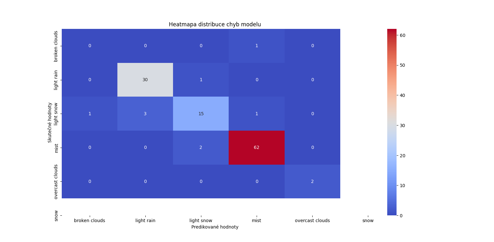
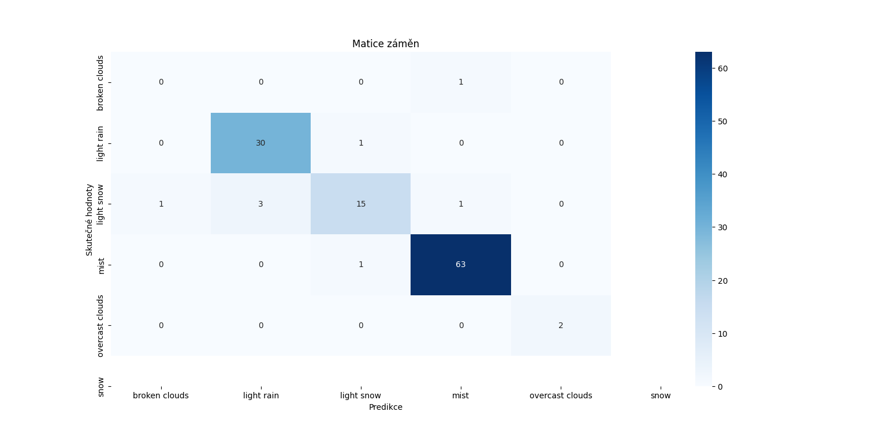
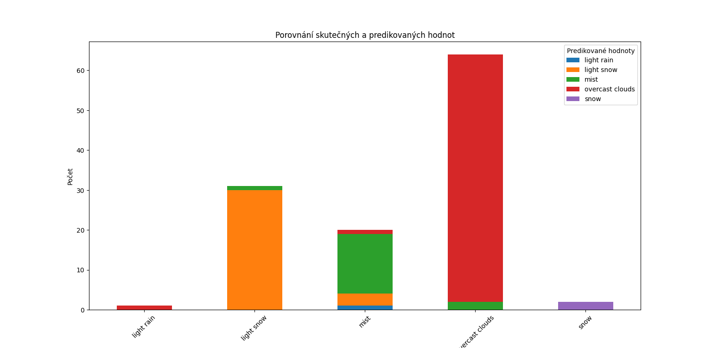

# 🌦 Predikce Počasí – Machine Learning Model

> **Automatická analýza a predikce počasí na základě historických a aktuálních dat.**  
> Projekt kombinuje sběr dat z OpenWeather API, analýzu trendů, vizualizaci a predikční model.

---

##  O projektu
-  Automatické stahování dat** – OpenWeather API každou minutu.
-  Predikční model** – RandomForestClassifier na základě historických dat.
-  Pokročilé vizualizace** – heatmapy, klasifikační matice, rozdělení počasí podle částí dne.
-  Analyzuje metriky jako**: teplota, pocitová teplota, rychlost větru, část dne.
-  Hodnocení modelu:** Accuracy, MSE, R2 skóre.

---

## jak spustit projekt?

1️⃣ Klonování repozitáře:
git clone https://github.com/Katy-Coder-Kat/Predikce-pocasi.git
cd Predikce-pocasi

2️⃣ Instalace závislostí:
pip install -r requirements.txt

3️⃣ Spuštění automatického sběru dat:
python "pocasi API.py"
Tento skript se dotazuje OpenWeather API každou minutu a ukládá data do pocasi_data.csv.

4️⃣ Spuštění predikčního modelu:
python "predikce_modelu.py"
Trénuje Random Forest Classifier a vyhodnocuje přesnost modelu.

##  **Použité technologie**
✅ **Python** (Pandas, NumPy, Scikit-learn, Matplotlib, Seaborn)  
✅ **OpenWeather API** (automatické získávání dat)  
✅ **RandomForestClassifier** (strojové učení)  

---

##  **Plán vývoje (Roadmap)**
✅ **1. Implementace základního modelu (RandomForestClassifier)**  
✅ **2. Přidání vizualizace výsledků**  
🟡 **3. Vylepšení přesnosti modelu**

## 📊 **Ukázka výstupu**

### **Heatmapa klasifikační matice**  
📌 Ukazuje chyby modelu při predikci počasí.  

### **Graf vývoje teploty během dne**  
📌 Vizualizuje časovou změnu teplot.  

### **Další vizualizace modelu**  
📌 Pokročilé vizualizace predikovaných a skutečných hodnot.  

